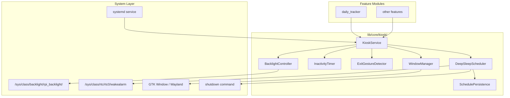

# Design Document: Raspberry Pi Touch Display Kiosk Service

## Overview

This design defines the architecture for a Kiosk Service that transforms the Flutter Linux application on a Raspberry Pi 5 with Touch Display 2 into a dedicated single-purpose appliance. The service lives in `lib/core/kiosk/` and exposes a clean public API that any feature module can consume via `get_it` dependency injection.

The Kiosk Service orchestrates five core capabilities:
1. **Fullscreen window management** — GTK window manipulation for borderless fullscreen with cursor hiding
2. **Inactivity-based display sleep** — Timer-driven backlight control via sysfs
3. **Touch wake with event consumption** — Backlight restoration on touch with first-event discard
4. **Exit gesture detection** — 5-tap-in-3-seconds pattern recognition
5. **Scheduled deep sleep** — RTC wake alarm programming and system shutdown

The service is platform-guarded: on non-Linux platforms, all operations are safe no-ops, allowing feature modules to call the API unconditionally.

## Architecture



### Layer Responsibilities

| Layer | Responsibility |
|-------|---------------|
| Feature modules | Consume `KioskService` via `get_it`, call `enterKioskMode()` on startup |
| KioskService (Facade) | Orchestrates all sub-components, exposes public API, emits state stream |
| BacklightController | Reads/writes sysfs files for backlight power and brightness |
| InactivityTimer | Manages countdown, resets on touch, fires expiry callback |
| ExitGestureDetector | Tracks tap timestamps, recognizes 5-in-3s pattern |
| DeepSleepScheduler | Manages scheduled shutdown/wake, writes RTC alarm, calls shutdown |
| WindowManager | GTK fullscreen, decoration removal, cursor hiding, always-on-top |
| SchedulePersistence | Persists schedule config to `shared_preferences` |

## Components and Interfaces

### KioskService (Facade)

```dart
abstract class IKioskService {
  /// Current kiosk state as a stream
  Stream<KioskState> get stateStream;

  /// Current state snapshot
  KioskState get currentState;

  /// Enter kiosk mode: fullscreen, hide cursor, start inactivity timer
  Future<void> enterKioskMode();

  /// Exit kiosk mode: restore window, show cursor, stop timers
  Future<void> exitKioskMode();

  /// Manually sleep the display
  Future<void> sleepDisplay();

  /// Manually wake the display
  Future<void> wakeDisplay();

  /// Configure inactivity timeout duration
  void setInactivityTimeout(Duration duration);

  /// Configure scheduled shutdown time (null to clear)
  Future<void> setShutdownTime(TimeOfDay? time);

  /// Configure scheduled wake-up time (null to clear)
  Future<void> setWakeUpTime(TimeOfDay? time);

  /// Enable or disable scheduled deep sleep
  Future<void> setDeepSleepEnabled(bool enabled);

  /// Get current deep sleep schedule
  DeepSleepSchedule get schedule;

  /// Register a touch event (called by the gesture layer)
  void onTouchEvent();

  /// Dispose all resources
  Future<void> dispose();
}
```

### KioskState

```dart
enum KioskMode { idle, active }
enum DisplayState { awake, sleeping }

class KioskState {
  final KioskMode mode;
  final DisplayState displayState;
  final bool deepSleepEnabled;
  final Duration inactivityTimeout;

  const KioskState({
    this.mode = KioskMode.idle,
    this.displayState = DisplayState.awake,
    this.deepSleepEnabled = false,
    this.inactivityTimeout = const Duration(minutes: 10),
  });

  KioskState copyWith({...});
}
```

### BacklightController

```dart
abstract class IBacklightController {
  /// Turn off the display backlight (bl_power = 1)
  Future<bool> turnOff();

  /// Turn on the display backlight (bl_power = 0)
  Future<bool> turnOn();

  /// Set brightness (0-255)
  Future<bool> setBrightness(int value);

  /// Read current backlight power state
  Future<bool> isOn();
}
```

Implementation writes to `/sys/class/backlight/rpi_backlight/bl_power`:
- `0` = backlight ON
- `1` = backlight OFF

Fallback: if sysfs path doesn't exist, attempts `vcgencmd display_power 0|1`.

### InactivityTimer

```dart
abstract class IInactivityTimer {
  /// Start the timer with the configured duration
  void start(Duration duration);

  /// Reset the timer (restarts countdown)
  void reset();

  /// Stop the timer
  void stop();

  /// Stream that emits when the timer expires
  Stream<void> get onExpired;

  /// Whether the timer is currently running
  bool get isRunning;

  void dispose();
}
```

### ExitGestureDetector

```dart
abstract class IExitGestureDetector {
  /// Record a tap event. Returns true if exit gesture is recognized.
  bool recordTap(DateTime timestamp);

  /// Reset the detector state
  void reset();

  /// Configuration: number of taps required (default 5)
  int get requiredTaps;

  /// Configuration: time window (default 3 seconds)
  Duration get timeWindow;
}
```

The detector maintains a sliding window of tap timestamps. When `recordTap` is called:
1. Remove timestamps older than `timeWindow` from the current timestamp
2. Add the new timestamp
3. If count >= `requiredTaps`, return `true` (exit gesture recognized)

### DeepSleepScheduler

```dart
abstract class IDeepSleepScheduler {
  /// Set the daily shutdown time
  Future<void> setShutdownTime(TimeOfDay? time);

  /// Set the daily wake-up time
  Future<void> setWakeUpTime(TimeOfDay? time);

  /// Enable/disable the scheduler
  Future<void> setEnabled(bool enabled);

  /// Get current schedule
  DeepSleepSchedule get schedule;

  /// Start monitoring (called when kiosk mode enters)
  void startMonitoring();

  /// Stop monitoring
  void stopMonitoring();

  /// Check if user is actively interacting (touch within last 60s)
  bool isUserActive(DateTime lastTouchTime);

  /// Calculate the epoch seconds for the next wake alarm
  int calculateWakeAlarmEpoch(TimeOfDay wakeTime, DateTime fromDate);

  /// Initiate shutdown sequence
  Future<void> initiateShutdown();

  void dispose();
}

class DeepSleepSchedule {
  final TimeOfDay? shutdownTime;
  final TimeOfDay? wakeUpTime;
  final bool enabled;

  const DeepSleepSchedule({
    this.shutdownTime,
    this.wakeUpTime,
    this.enabled = false,
  });
}
```

### WindowManager

```dart
abstract class IWindowManager {
  /// Set fullscreen mode without decorations
  Future<void> enterFullscreen();

  /// Restore normal windowed mode
  Future<void> exitFullscreen();

  /// Hide the mouse cursor
  Future<void> hideCursor();

  /// Show the mouse cursor
  Future<void> showCursor();

  /// Set window always on top
  Future<void> setAlwaysOnTop(bool value);

  /// Set window size
  Future<void> setSize(int width, int height);
}
```

On Linux, this uses `Process.run` to invoke `xdotool` or `wmctrl` commands, or directly manipulates the GTK window via method channels. The Flutter Linux embedding already sets the window to 1280×720 in `my_application.cc`.

### KioskInjectionModule

```dart
class KioskInjectionModule {
  KioskInjectionModule._();
  static final _instance = KioskInjectionModule._();
  factory KioskInjectionModule() => _instance;

  final GetIt injector = GetIt.instance;

  void registerDependencies() {
    injector.registerLazySingleton<IBacklightController>(
      () => BacklightControllerImpl(),
    );
    injector.registerLazySingleton<IInactivityTimer>(
      () => InactivityTimerImpl(),
    );
    injector.registerLazySingleton<IExitGestureDetector>(
      () => ExitGestureDetectorImpl(),
    );
    injector.registerLazySingleton<IDeepSleepScheduler>(
      () => DeepSleepSchedulerImpl(
        injector<ISchedulePersistence>(),
      ),
    );
    injector.registerLazySingleton<IWindowManager>(
      () => WindowManagerImpl(),
    );
    injector.registerLazySingleton<ISchedulePersistence>(
      () => SchedulePersistenceImpl(),
    );
    injector.registerLazySingleton<IKioskService>(
      () => KioskServiceImpl(
        backlightController: injector<IBacklightController>(),
        inactivityTimer: injector<IInactivityTimer>(),
        exitGestureDetector: injector<IExitGestureDetector>(),
        deepSleepScheduler: injector<IDeepSleepScheduler>(),
        windowManager: injector<IWindowManager>(),
      ),
    );
  }
}
```

### KioskGestureWrapper (Widget)

A widget that wraps the app's root to intercept all touch events for the kiosk service:

```dart
class KioskGestureWrapper extends StatelessWidget {
  final Widget child;
  final IKioskService kioskService;

  /// Wraps the child with a Listener that forwards touch events
  /// to the KioskService for inactivity tracking and exit gesture detection.
  /// When the display is sleeping, the first touch wakes it and is consumed.
}
```

This widget uses a `Listener` (not `GestureDetector`) to capture all pointer-down events without interfering with child gesture recognizers.

## Data Models

### Persisted Schedule Configuration

Stored in `shared_preferences` under the key `kiosk_deep_sleep_schedule`:

```json
{
  "shutdownHour": 22,
  "shutdownMinute": 0,
  "wakeUpHour": 7,
  "wakeUpMinute": 0,
  "enabled": true
}
```

### Kiosk Exit Codes

| Exit Code | Meaning | Systemd Behavior |
|-----------|---------|-----------------|
| 0 | Normal exit (Exit_Gesture) | No restart |
| Non-zero | Crash / unexpected termination | Restart after 5s |

### Systemd Service File (`kiosk-app.service`)

```ini
[Unit]
Description=Flutter Kiosk Application
After=graphical.target
Wants=graphical.target

[Service]
Type=simple
User=pi
Environment=DISPLAY=:0
Environment=XAUTHORITY=/home/pi/.Xauthority
ExecStart=/home/pi/kiosk-app/build/linux/arm64/release/bundle/sample_latest
Restart=on-failure
RestartSec=5
StartLimitBurst=5
StartLimitIntervalSec=60

[Install]
WantedBy=graphical.target
```

Key design decisions:
- `Restart=on-failure` ensures exit code 0 (from Exit_Gesture) does NOT trigger restart
- `StartLimitBurst=5` + `StartLimitIntervalSec=60` implements the crash rate limiting
- `After=graphical.target` ensures the display server is available before launch

### Sysfs Paths

| Path | Purpose |
|------|---------|
| `/sys/class/backlight/rpi_backlight/bl_power` | Backlight on (0) / off (1) |
| `/sys/class/backlight/rpi_backlight/brightness` | Brightness level (0-255) |
| `/sys/class/rtc/rtc0/wakealarm` | RTC wake alarm (epoch seconds) |

### File Structure

```
lib/core/kiosk/
├── kiosk_service.dart              # IKioskService interface
├── kiosk_service_impl.dart         # KioskServiceImpl facade
├── kiosk_state.dart                # KioskState, KioskMode, DisplayState
├── kiosk_injection_module.dart     # DI registration
├── kiosk_gesture_wrapper.dart      # Root gesture interception widget
├── controllers/
│   ├── backlight_controller.dart   # IBacklightController + impl
│   ├── window_manager.dart         # IWindowManager + impl
│   └── exit_gesture_detector.dart  # IExitGestureDetector + impl
├── services/
│   ├── inactivity_timer.dart       # IInactivityTimer + impl
│   ├── deep_sleep_scheduler.dart   # IDeepSleepScheduler + impl
│   └── schedule_persistence.dart   # ISchedulePersistence + impl
└── platform/
    ├── linux_process_runner.dart    # Abstraction over Process.run for testability
    └── sysfs_writer.dart           # Abstraction over File I/O for sysfs
```

## Correctness Properties

*A property is a characteristic or behavior that should hold true across all valid executions of a system — essentially, a formal statement about what the system should do. Properties serve as the bridge between human-readable specifications and machine-verifiable correctness guarantees.*

### Property 1: Inactivity timer resets on touch

*For any* sequence of touch events at arbitrary times while the kiosk is active and the display is awake, each touch event SHALL cause the inactivity timer to reset to the configured timeout duration, such that the remaining time equals the full timeout immediately after the event.

**Validates: Requirements 3.1**

### Property 2: Timer expiry triggers display sleep

*For any* kiosk state where the display is awake and the inactivity timer is running, when the timer expires (remaining time reaches zero), the backlight controller SHALL be invoked to turn off the display, and the kiosk state SHALL transition to `DisplayState.sleeping`.

**Validates: Requirements 3.2**

### Property 3: Touch wakes sleeping display

*For any* kiosk state where the display is sleeping, when a touch event occurs, the backlight controller SHALL be invoked to turn on the display, and the kiosk state SHALL transition to `DisplayState.awake`.

**Validates: Requirements 4.1**

### Property 4: Wake touch is consumed

*For any* touch event that triggers a display wake (i.e., occurs while `DisplayState.sleeping`), that touch event SHALL NOT be forwarded to the application's gesture system, preventing unintended UI interactions.

**Validates: Requirements 4.2**

### Property 5: Exit gesture recognition

*For any* sequence of tap timestamps, the exit gesture detector SHALL return `true` if and only if there exist at least 5 taps within any 3-second sliding window. Sequences with fewer than 5 taps in any 3-second window SHALL NOT trigger exit.

**Validates: Requirements 5.1, 5.4**

### Property 6: Kiosk state stream correctness

*For any* sequence of kiosk operations (enter, exit, sleep, wake), the state stream SHALL emit exactly one state change event per operation, and the emitted state SHALL accurately reflect the result of that operation.

**Validates: Requirements 9.7**

### Property 7: Schedule persistence round-trip

*For any* valid `DeepSleepSchedule` (with shutdown hour 0-23, minute 0-59, wake hour 0-23, minute 0-59, and enabled boolean), persisting the schedule and then loading it SHALL produce an identical schedule.

**Validates: Requirements 10.5**

### Property 8: Active interaction delays shutdown

*For any* configured shutdown time and any last-touch timestamp that is within 60 seconds before the shutdown time, the system SHALL delay the shutdown by exactly 5 minutes rather than initiating it immediately.

**Validates: Requirements 10.7**

### Property 9: RTC wake alarm calculation

*For any* valid wake-up time (hour and minute) and any reference date, the calculated RTC alarm epoch SHALL correspond to the next occurrence of that time-of-day relative to the reference date (i.e., same day if the time hasn't passed, next day if it has).

**Validates: Requirements 10.3**

## Error Handling

| Scenario | Handling Strategy |
|----------|------------------|
| Sysfs backlight path doesn't exist | Fall back to `vcgencmd display_power`; if that also fails, log warning and treat as no-op |
| RTC wakealarm write fails | Log error, skip shutdown, emit error state on stream |
| `shutdown` command fails (permissions) | Log error, emit error state; systemd service should run as user with sudo NOPASSWD for shutdown |
| Window manager commands fail | Log warning, continue; kiosk mode degrades gracefully |
| Shared preferences read/write fails | Use in-memory defaults, log warning |
| Platform is not Linux | All operations are no-ops; `enterKioskMode()` resolves immediately with idle state |
| Timer fires during dispose | Guard all timer callbacks with `_isDisposed` flag |
| Concurrent state mutations | Use a single `StreamController<KioskState>.broadcast()` with synchronous state updates |

### Exit Code Contract

The `KioskServiceImpl.exitKioskMode()` method calls `exit(0)` to signal intentional exit. Any unhandled exception or crash results in a non-zero exit code, which systemd interprets as a failure requiring restart.

### Permissions

The systemd service runs as user `pi`. Required permissions:
- Read/write to `/sys/class/backlight/rpi_backlight/` (via udev rule or group membership)
- Write to `/sys/class/rtc/rtc0/wakealarm` (via udev rule)
- Execute `sudo shutdown -h now` (via sudoers NOPASSWD entry)

A setup script (`scripts/setup_kiosk_permissions.sh`) configures these.

## Testing Strategy

### Property-Based Tests

The feature uses **fast_check** (Dart property-based testing library) for property tests. Each property test runs a minimum of 100 iterations.

Properties to implement:
1. **Inactivity timer reset** — Generate random touch event sequences, verify timer state
2. **Timer expiry triggers sleep** — Generate random timeout durations, verify state transition
3. **Touch wakes display** — Generate random sleep states, verify wake behavior
4. **Wake touch consumption** — Generate touch events during sleep, verify non-propagation
5. **Exit gesture recognition** — Generate random tap timestamp sequences, verify correct detection
6. **State stream correctness** — Generate random operation sequences, verify stream emissions
7. **Schedule persistence round-trip** — Generate random schedules, verify save/load identity
8. **Active interaction delays shutdown** — Generate random timing scenarios, verify delay logic
9. **RTC wake alarm calculation** — Generate random times and dates, verify epoch calculation

Tag format: `// Feature: raspberry-pi-touch-display, Property {N}: {title}`

### Unit Tests (Example-Based)

| Component | Test Cases |
|-----------|-----------|
| KioskService | Enter/exit mode transitions, platform guard (no-op on non-Linux) |
| BacklightController | Correct sysfs values written for on/off, fallback to vcgencmd |
| WindowManager | Fullscreen/restore commands, cursor hide/show |
| DeepSleepScheduler | Enable/disable, shutdown time reached, wake time calculation |
| ExitGestureDetector | Exactly 5 taps triggers, 4 taps doesn't, taps spread over >3s don't trigger |
| InactivityTimer | Start/stop/reset lifecycle, expiry callback fires |

### Integration Tests

| Scenario | Approach |
|----------|----------|
| Systemd service restart on crash | Deploy to Pi, kill process, verify restart within 5s |
| Systemd no-restart on exit code 0 | Deploy to Pi, trigger exit gesture, verify no restart |
| Backlight sysfs control | Run on Pi, verify `/sys/class/backlight/rpi_backlight/bl_power` changes |
| RTC wake alarm | Write alarm, verify `/sys/class/rtc/rtc0/wakealarm` contains correct epoch |
| Boot-to-kiosk | Reboot Pi, verify app launches fullscreen automatically |

### Mocking Strategy

All system interactions are abstracted behind interfaces:
- `IBacklightController` — mock sysfs reads/writes
- `IWindowManager` — mock GTK/xdotool commands
- `IDeepSleepScheduler` — mock RTC writes and shutdown commands
- `LinuxProcessRunner` — mock `Process.run` calls

This allows all property and unit tests to run on any platform (macOS, CI) without requiring a Raspberry Pi.
